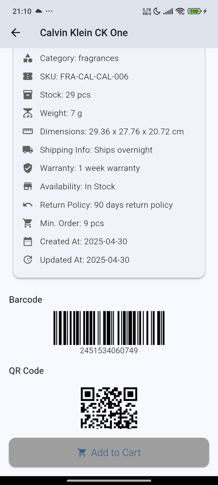

# Product_app

Aplikasi Flutter yang menggunakan API untuk melakukan GET data produk dan menampilkan daftar produk beserta halaman detail ketika salah satu produk diklik.

## 🏪 Tampilan Awal

Berikut adalah informasi yang ditampilkan pada halaman awal:
- Gambar produk  
- Nama produk  
- Kategori produk  
- Rating produk  
- Harga produk  
- Stok produk  

## 📄 Tampilan Halaman Detail

Ketika produk diklik, halaman detail akan menampilkan:
- Gambar produk  
- Nama produk  
- Kategori produk  
- Harga produk  
- Diskon produk  
- Rating produk  
- Deskripsi produk  
- Barcode produk  
- QR Code produk  
- Customer reviews  

## 📸 Preview

Berikut adalah beberapa tangkapan layar aplikasi:

  
  
  
  
  
